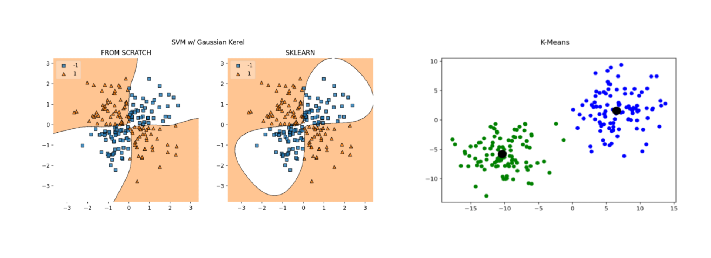

# ML-BASICS

**UNDER CONSTRUCTION**

**WORK IN PROGRESS: Currently in the progress of reorganizing the files so this
repo is an absolute mess right now.**

My implimentation of Machine Learning Models from Scratch with Python. Models
include Support Vector Machines (SVM), Logistic Regression, K-Means Clustering,
KNN, and more. Please contact me with any questions, bugs, or typos.

 

---

## Road Map:

**BOLDS** are things I have begun or finished.

### Supervised Learning
1. Classification:
    - **Logistic Regression** & Multinomial Logistic Regression
    - **Support Vector Machines (SVM)**
    - Naive Bayes
    - **K-Nearest-Neighbors (KNN)**
    
2. Regression:
    - **Linear Regression**
    - **Polynomial Regression**
    - **Lasso Regression (L1)**
    - **Ridge Regression (L2)**
    - **Partial Least Squares (PLS)**
    - Principle Component Regression (PCR)

3. Ensemble & Tree Based Methods:
    - Random Forest
    - XGBoost
    - Adaboost
    - Boosting
    - Bagging

4. Deep Learning:
    - **Multilayer Perceptron (MLP)**
    - **Convolutional Neural Networks (CNNs)**
    - Recurrent Neural Networks (RNNs)
    - Generative Adversarial Nets (GANs)
    - Transformers and Attention Based Methods.

### Unsupervised Learning
1. Clustering
    - **K-Means**
    - Mean Shift
    - DBSCAN
    - Spectral Clustering
    - Hierarchical Clustering 
    - Expectation Maximization (EM) with Gaussian Mixture Models (GMM)

2. Dimensionality Reduction
    - Principle Component Analysis (PCA)
    - t-SNE
    - UMAP
    

### Analysis:
1. Metrics
    - Accuracy
    - Precision
    - Recall
    - f1
    - R^2
    - Mean Squared Error (MSE)
    - Mean Absolute Error (MAE)
    - Mean Average Precision (MAP)
    - Mean Average Precision Intersection over Union (MAP IoU)

 

---

## MNIST Classification with KNN

The MNIST dataset is a collection of handwritten digits that we can use to
train a handwritten digit classification model on. To give an intuitive 
example: 

 

 

 

Using a KNN model with optimizations via approximations to avoid calculating the 
computationally expensive L2 norm for every 60,000th digit in the dataset I was able
acheive an average of 95% accuracy. The confusion matrix for this model is:

 

 

 

Find the code and more detail in my jupyter notebook: 
https://github.com/ryanirl/ml-basics/blob/main/examples/knn_mnist_classification/KNN_mnist.ipynb

 

<!-- LICENSE -->
## License

Distributed under the MIT License. See `LICENSE` for more information.

