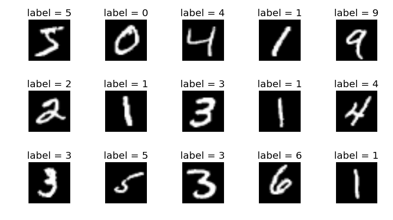
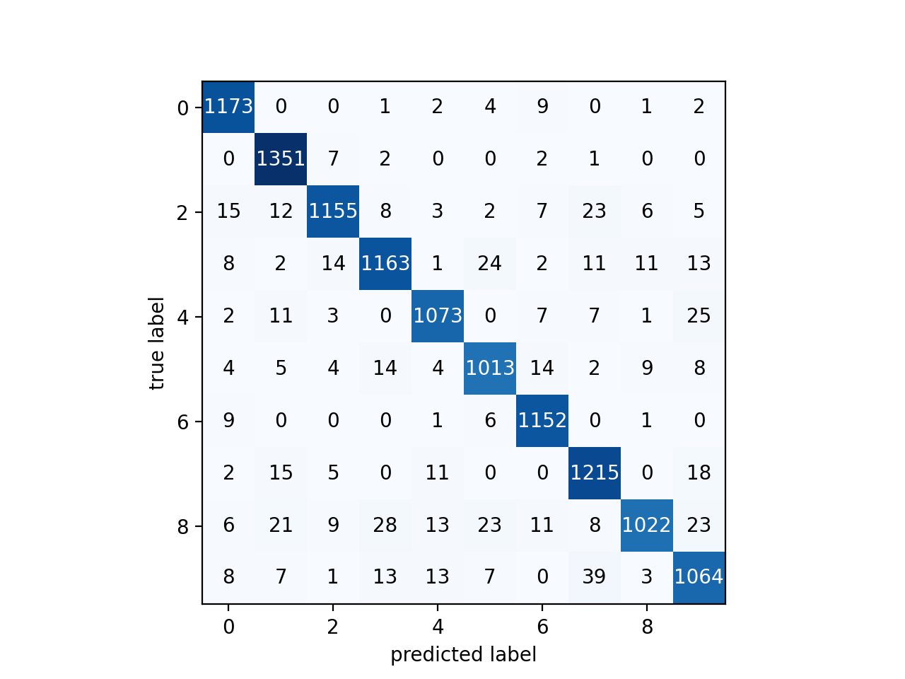

# ML-BASICS

### WORK IN PROGRESS

Implimentation of some basic Machine Learning Models with Python. Topics including Support Vector Machines (SVM), Logistic Regression, K-Means Clustering, and more. Please contact me with any questions, bugs, or typos.

 

 

**Currently Working On:** mnist Classification with SVM

*PROBLEMS:* Hit a roadblock where I don't have the proper prerequisites in probability to understand bayesian "stuff" and so I have been spending some time taking MIT OCW's 18.600 to better prepare myself. This will slow down the progress in this repo.
 
 
 
---

## Road Map:

**BOLDS** are things I have begun.

### Supervised Learning
1. Classification
    - **Logistic Regression** & Multinomial Logistic Regression
    - **Support Vector Machines (SVM)**
    - Naive Bayes
    - **K-Nearest-Neighbors (KNN)**
    - Decision Trees & Random Forest
    
2. Regression
    - **Linear Regression**
    - **Polynomial Regression**
    - Lasso Regression (L1)
    - Ridge Regression (L2)
    - **Partial Lease Squares (PLS)**
    - Principle Component (PCR)

3. Neural Networks
    - CNN
    - RNN
    - Transformer Networks
    - Generative Adversarial Nets (GAN)

4. Boosting
    - XGBoost
    - AdaBoost
    - Gradient Tree Boosting
    

### Unsupervised Learning
1. Clustering
    - **K-Means**
    - Mean Shift
    - Expectation Maximization (EM) with Gaussian Mixture Models (GMM)

2. Dimensionality Reduction
    - Principle Component Analysis (PCA)
    
    
### Analysis of Model
1. Classification
    - **Accuracy**
    - Precision
    - Recall
    - f1
    - **Confusion Matrix**
    - Mean Average Precision

2. Regression
    - Mean Squared Error (MSE)
    - Mean Absolute Error (MAE)
    - R squared

3. Bias and Variance of Models

 

---

## MNIST Classification with KNN

The MNIST dataset is a collection of handwritten digits than we can then use to train some classification model that can make predictions given new handwritten digits. this is a pretty intuitive example:

 

 

Using the K-Nearest-Neighbor model with the Annoy library to optimize the computationally expensive L2 norm I was able to create a model that can train on the entire MNIST dataset in under 20 seconds on a Macbook Pro with an average 95% accuracy. Plotting its confusion matrix gives:

 

 

Find the code and more detail in my jupyter notebook: https://github.com/ryanirl/ml-basics/tree/main/mnist_classification/KNN_mnist.ipynb

 

