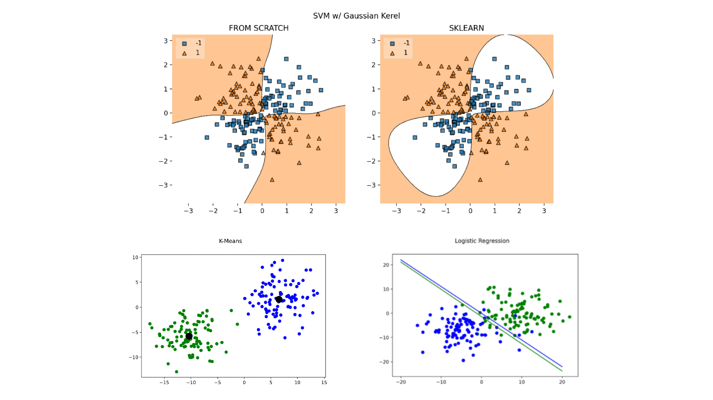

# ML-BASICS

 

 

**WORK IN PROGRESS**

*Currently Working On:* mnist Classification with SVM

PROBLEMS: Hit a roadblock where I don't have the proper prerequisites in probability to understand bayesian "stuff" and so I have been spending some time taking MIT OCW's 18.600 to better prepare myself. This will slow down the progress in this repo.
 
 
 
---

## Road Map:

### Supervised Learning
1. Classification
    - Logistic Regression & Multinomial Logistic Regression
    - Support Vector Machines (SVM)
    - Naive Bayes
    - K-Nearest-Neighbors (KNN)
    - Decision Trees & Random Forest
    
2. Regression
    - Linear Regression
    - Polynomial Regression
    - Lasso Regression (L1)
    - Ridge Regression (L2)
    - Partial Lease Squares (PLS)
    - Principle Component (PCR)

3. Neural Networks
    - CNN
    - RNN
    - Transformer Networks
    - Generative Adversarial Nets (GAN)

4. Boosting
    - XGBoost
    - AdaBoost
    - Gradient Tree Boosting
    

### Unsupervised Learning
1. Clustering
    - K-Means
    - Mean Shift
    - Expectation Maximization (EM) with Gaussian Mixture Models (GMM)

2. Dimensionality Reduction
    - Principle Component Analysis (PCA)
    
    
### Analysis of Model
1. Classification
    - Accuracy
    - Precision
    - Recall
    - f1
    - Confusion Matrix
    - Mean Average Precision

2. Regression
    - Mean Squared Error (MSE)
    - Mean Absolute Error (MAE)
    - R squared

3. Bias and Variance of Models

