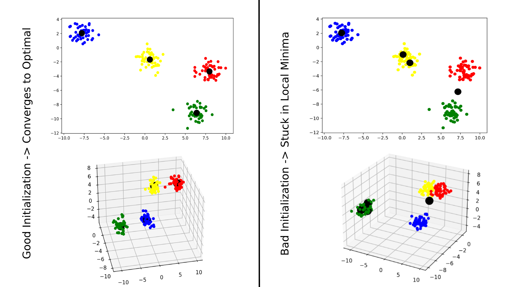

# Clustering 

---

## Clustering Models TODO:
    - K Means (make more intuitive and structure better)
         - Make more intuitive
         - Stucture class better
         - Fix local minima problem w/ KMeans++
    - Means Shift
    - DBSCAN
    - Gaussian Mixture Model (GMM)
    - Affinity Propogation

---

## K Means

K Means seems to get stuck in local minima a lot if you get unlucky with the
random initialization of the K clusters. One attempt to solve this would be to
pick smarter initalizations of your clusters using something like the KMeans++ 
algorithm. For 2D data with 2 clusters it seems to work everytime, though when
increasing the dimensions and clusters it seems to get stuck in local minima 
more and more often. 

 

 

 

---

## Means Shift

 

---

## DBSCAN

 

---

## Gaussian Mixture Model (GMM)

 

---

## Affinity Propogation

 

---

<!-- LICENSE -->
## License

Distributed under the MIT License. See `LICENSE` for more information.

