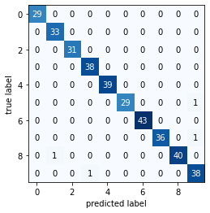

# K Nearest Neighbor (KNN)


Link to the Guide: https://github.com/ryanirl/ml-basics/blob/main/k_nearest/k_nearest_neighbors.ipynb

<!-- GUIDE TABLE OF CONTENTS -->
## Guide Table of Contents: 
1. KNN Explained
2. Basic from Scratch Implimentation
3. Visualization
4. Final Words


<br />

    
<!-- RESULTS -->
## Results

`knn.py` is used a highly processed mnist dataset. Running `$python3 knn.py` gives:

```
Number of Predictions: 360 | Accurary: 0.9888888888888889
```

<p align="center">
    
</p>


<br />

<!-- LICENSE -->
## License

Distributed under the MIT License. See `LICENSE` for more information.


