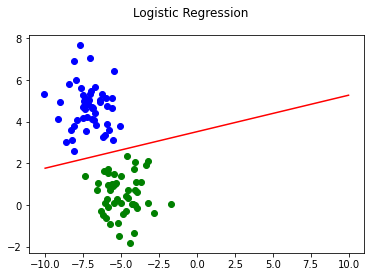

# Logistic Regression From Scratch

Find the Guide here: https://github.com/ryanirl/ml-basics/blob/main/logistic_regression/logistic_regression_guide.ipynb


<!-- GUIDE TABLE OF CONTENTS -->
## Guide Table of Contents
1. Logistic Regression Hypothesis 
2. Loss Function & Intro to Negative Log-Likelihood (NLL)
3. Gradient Descent for NLL
4. Implimentation

<br />


<!-- LOGISTIC REGRESSION -->
## logistic_regression.py

Running the script `$python3 logistic_regression.py` gives:


```
Loss on step 0 is: 0.4459884197619967
Loss on step 500 is: 0.03562543561883667
Loss on step 1000 is: 0.02056306128077044
Loss on step 1500 is: 0.014915202660124357
Loss on step 2000 is: 0.011888555767224581
Loss on step 2500 is: 0.009974829294183099
Loss on step 3000 is: 0.008643202944225777
Loss on step 3500 is: 0.0076568411726937674
Loss on step 4000 is: 0.00689332071079478
Loss on step 4500 is: 0.00628263891582526
```

    

    

<br />

<!-- LICENSE -->
## License

Distributed under the MIT License. See `LICENSE` for more information.
