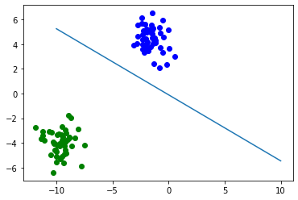

# The Perceptron

You can find the guide here: https://github.com/ryanirl/ml-basics/blob/main/perceptron_algorithm/perceptron_algorithm_guide.ipynb

<!-- GUIDE TABLE OF CONTENTS -->
## Guide Table of Contents
1. Perceptron Algorithm Introduction & Notation
     - Hypothesis form
     - Hyper-plane definition
2. The actual Algorithm
3. Convergence Theorem with Proof
4. Implimentation in Python
5. Final Notes

 

<!-- PERCEPTRON -->
## perceptron.py

Running the script `$python3 logistic_regression.py` gives:

    

 

---

<!-- LICENSE -->
## License

Distributed under the MIT License. See `LICENSE` for more information.

