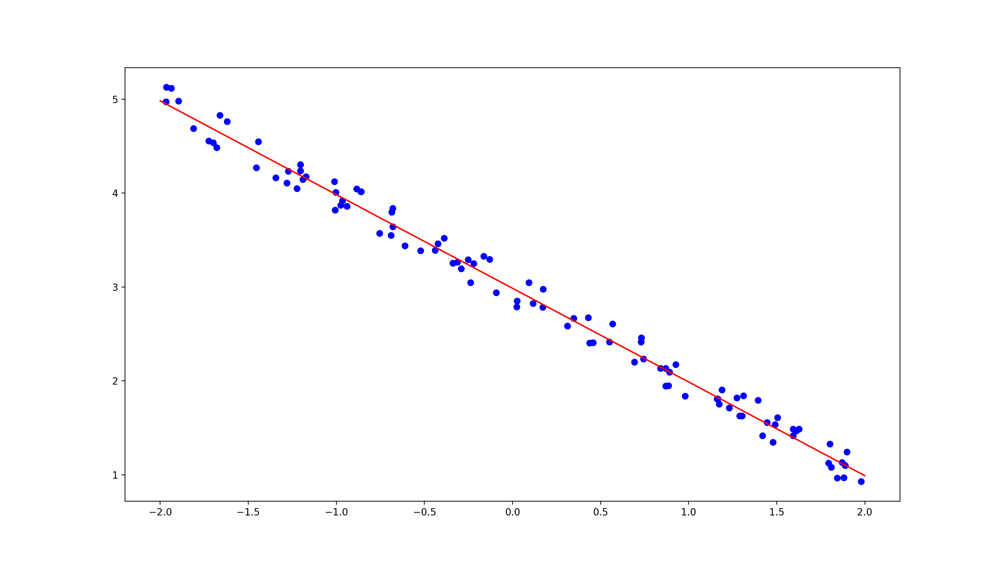
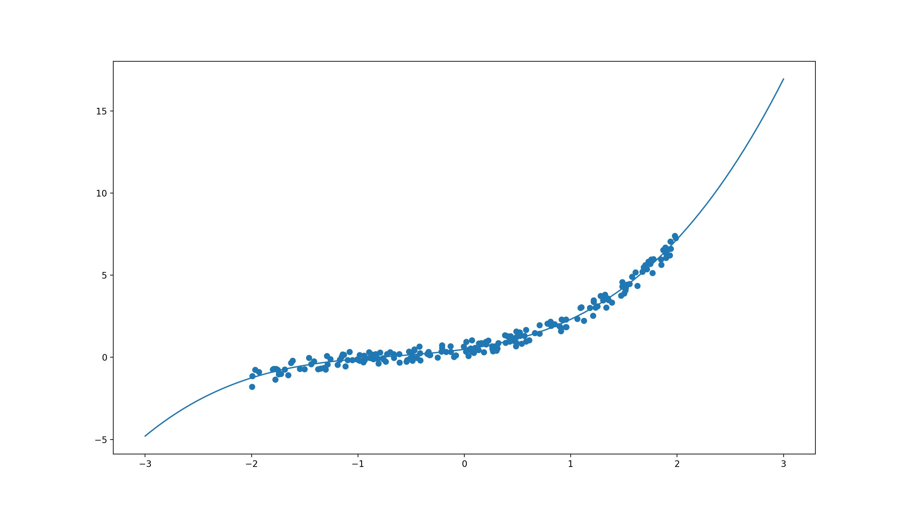

# Regression

<!-- TABLE OF CONTENTS -->
## Table of Contents
1. Linear Regression (w/ Regularization)
2. Polynomial Regression


<br />


<!-- LINEAR REGRESSION -->
## linear_regression.py

Running the script `$python3 linear_regression.py` gives:

```
Loss at epoch 0 is: 456.3545240285605
Loss at epoch 100 is: 10.183958367594736
Loss at epoch 200 is: 0.2062320036644082
Loss at epoch 300 is: 0.004021111170011886
Loss at epoch 400 is: 7.719896659146818e-05
Loss at epoch 500 is: 1.4725689156554897e-06
Loss at epoch 600 is: 2.8013266109018642e-08
Loss at epoch 700 is: 5.323000905749096e-10
Loss at epoch 800 is: 1.010975022628867e-11
Loss at epoch 900 is: 1.9197122625422572e-13
weight0: [-0.99826152] | bias: [2.98648996]
```

<p align="center">
 
</p>


<!-- POLYNOMIAL REGRESSION -->
## polynomial_regression.py

Running the script `$python3 polynomial_regression.py` gives:


```
[[0.90242544]
 [0.62056687]
 [0.30220896]] [[0.48734994]]
```


<p align="center">
 
</p>


<!-- LICENSE -->
## License

Distributed under the MIT License. See `LICENSE` for more information 

