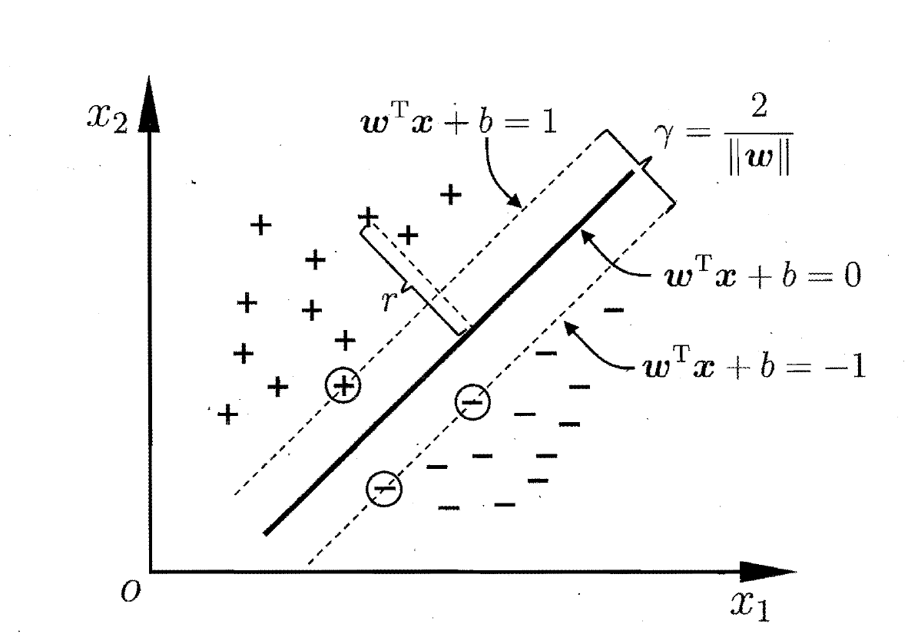
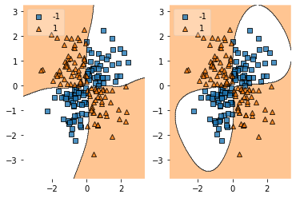
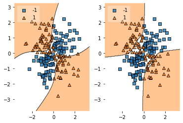
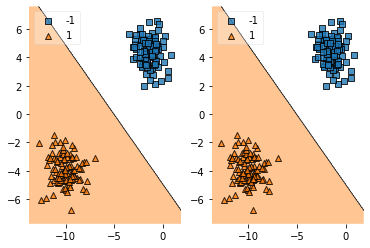

# SVM
---

**IMPORTANT NOTES:** 

**1.** This "guide" assumes a pretty advanced knowledge of SVM's already. More
specifically, it will assume all knowledge of these notes:
http://cs229.stanford.edu/summer2020/cs229-notes3.pdf

**2.** I also recommend that you download this notebook as sometimes github
doesn't render the equations properly.

**3.** Please message me with any questions or bugs regarding this notebook, I
will tag your github at the bottom of the notebook if "noteable" bugs are
found.


<!-- GUIDE TABLE OF CONTENTS -->
## Guide Table of Contents: 
1. SVM Defined
2. Optimization of SVM and it's forms
3. List of some well known Kernels
4. Introduction to CVXOPT
5. Converting Dual Form to CVXOPT required form
6. My Implimentation
7. Comparison with sklearn

<br />

---


<!-- THE SUPPORT VECTOR MACHINE (SVM) -->
## The Support Vector Machine (SVM) 


The Support Vector Machine (SVM) is another form of supervised learning of a classifier. Specifically, SVM's are a type of Margin Maximizer that along with a Kernel form the SVM. 


<p align="center">
    
</p>


<br />

---

    
<!-- RESULTS -->
## Results


```python
# GAUSSIAN COMPARISON * MINE IS ON THE LEFT * 

# Multiple Plots 
fig, (ax0, ax1) = plt.subplots(1, 2)

# My Implimentation
model = SVM()
model.fit(X, y)
plot_decision_regions(X, y_int_32, clf=model, legend=2, ax=ax0)

# sklearn Implimentation
sklearn_model = SVC(kernel='rbf')
sklearn_model.fit(X, y_int_32)
plot_decision_regions(X, y_int_32, clf=sklearn_model, legend=2, ax=ax1)

# SHOW PLOT
plt.show()
```
```

         pcost       dcost       gap    pres   dres
     0: -4.2942e+01 -3.4327e+02  1e+03  2e+00  8e-16
     1: -3.0263e+01 -1.8500e+02  2e+02  3e-02  9e-16
     2: -3.9805e+01 -6.6433e+01  3e+01  5e-03  8e-16
     3: -4.5939e+01 -5.4105e+01  8e+00  1e-03  8e-16
     4: -4.8241e+01 -5.0366e+01  2e+00  2e-04  8e-16
     5: -4.8953e+01 -4.9284e+01  3e-01  2e-05  9e-16
     6: -4.9081e+01 -4.9103e+01  2e-02  3e-07  9e-16
     7: -4.9090e+01 -4.9091e+01  6e-04  6e-09  8e-16
     8: -4.9091e+01 -4.9091e+01  2e-05  9e-11  1e-15
    Optimal solution found.

```

<p align="center">
    
</p>

    


```python
# Degree 6 Polynomial Comparison

# Multiple Plots 
fig, (ax0, ax1) = plt.subplots(1, 2)

# My Implimentation
model = SVM(kernel = polynomial, poly_degree = 6)
model.fit(X, y)
plot_decision_regions(X, y_int_32, clf=model, legend=2, ax=ax0)

# sklearn Implimentation
sklearn_model = SVC(kernel='poly', degree = 6)
sklearn_model.fit(X, y_int_32)
plot_decision_regions(X, y_int_32, clf=sklearn_model, legend=2, ax=ax1)

# SHOW PLOT
plt.show()
```
```
         pcost       dcost       gap    pres   dres
     0: -5.1879e+01 -3.6593e+02  2e+03  2e+00  1e-11
     1: -3.5316e+01 -2.0405e+02  3e+02  3e-01  1e-11
     2: -2.0932e+01 -9.9233e+01  1e+02  1e-01  8e-12
     3: -1.7587e+01 -5.1831e+01  5e+01  4e-02  3e-12
     4: -1.7137e+01 -3.6902e+01  3e+01  2e-02  1e-12
     5: -1.6057e+01 -3.0404e+01  2e+01  1e-02  1e-12
     6: -1.5597e+01 -2.0184e+01  7e+00  3e-03  4e-13
     7: -1.5326e+01 -1.7766e+01  4e+00  1e-03  2e-13
     8: -1.5001e+01 -1.6984e+01  3e+00  7e-04  1e-13
     9: -1.4990e+01 -1.6396e+01  2e+00  4e-04  5e-14
    10: -1.4923e+01 -1.6044e+01  2e+00  2e-04  5e-14
    11: -1.4812e+01 -1.5494e+01  7e-01  2e-05  4e-14
    12: -1.5055e+01 -1.5109e+01  6e-02  1e-06  3e-14
    13: -1.5077e+01 -1.5078e+01  2e-03  3e-08  3e-14
    14: -1.5077e+01 -1.5077e+01  2e-05  3e-10  3e-14
    15: -1.5077e+01 -1.5077e+01  2e-07  3e-12  2e-14
    Optimal solution found.

```


<p align="center">
    
</p>
    


```python
# Linear Model Comparison

# Multiple Plots 
fig, (ax0, ax1) = plt.subplots(1, 2)

X, y = make_blobs(n_samples = 200, centers = 2, random_state = 1)

y[y == 0] = -1
y_int_32 = y
y = y.reshape(-1,1) * 1.

# My Implimentation
model = SVM(kernel = linear)
model.fit(X, y)
plot_decision_regions(X, y_int_32, clf=model, legend=2, ax=ax0)

# sklearn Implimentation
sklearn_model = SVC(kernel='linear')
sklearn_model.fit(X, y_int_32)
plot_decision_regions(X, y_int_32, clf=sklearn_model, legend=2, ax=ax1)

# SHOW PLOT
plt.show()
```
```
         pcost       dcost       gap    pres   dres
     0: -4.5293e+00 -3.0618e+02  2e+03  2e+00  3e-14
     1: -2.0277e+00 -1.3245e+02  2e+02  2e-01  3e-14
     2: -1.8206e-01 -1.6209e+01  2e+01  2e-02  1e-14
     3:  5.9707e-02 -3.3357e-01  5e-01  2e-04  2e-15
     4: -9.3800e-03 -5.2070e-02  4e-02  9e-07  9e-16
     5: -1.7535e-02 -4.4347e-02  3e-02  5e-07  7e-16
     6: -3.1543e-02 -5.1713e-02  2e-02  1e-07  7e-16
     7: -3.8790e-02 -3.9629e-02  8e-04  6e-09  8e-16
     8: -3.9222e-02 -3.9230e-02  8e-06  6e-11  9e-16
     9: -3.9226e-02 -3.9226e-02  8e-08  6e-13  1e-15
    Optimal solution found.

```


<p align="center">
    
</p>
    
    

1. **Gaussian Kernel:** I would argue that my implimentation of the gaussian kernel (though I did tune the hyperparameters) would generalize better to unseen data than the "vanilla" sklearn would.
2. **Polynomial Kernel**: Just have to play around with the degrees a bit to find a best matching one for the data, but they are similar.
3. **Linear Kernel:** Basically the same for linearly seperable data. My model will fail horrendously if the data is not linearly seperable (just need to impliment soft margin). 

<br />

---

<!-- LICENSE -->
## License

Distributed under the MIT License. See `LICENSE` for more information.


